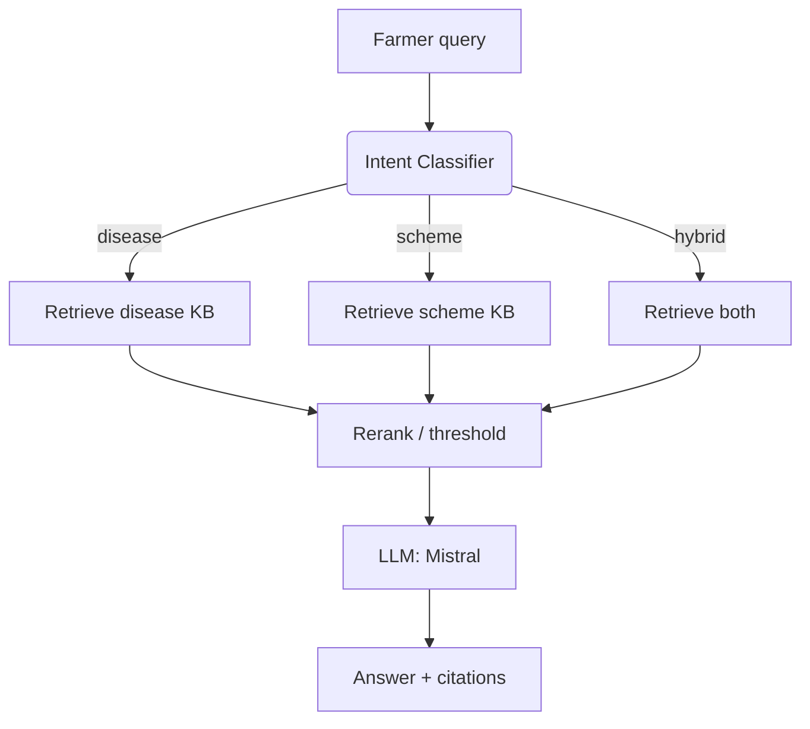

# Agrobot — Agriculture Chatbot API

Agentic RAG FastAPI backend that answers farmers’ questions about citrus diseases and government schemes. It classifies intent (disease, scheme, hybrid), routes to the right knowledge base, retrieves from Chroma, and generates concise, numbered guidance with Mistral.

## Architecture (visual)



Key files: intent routing in [app/agents/rag_agent.py](app/agents/rag_agent.py), LLM prompts in [app/services/llm_service.py](app/services/llm_service.py), FastAPI wiring in [app/main.py](app/main.py) and [app/api/v1/endpoints/query.py](app/api/v1/endpoints/query.py).

## Project structure

```
app/
├── api/v1/endpoints/query.py   # POST /api/v1/query
├── agents/intent_classifier.py # Intent detection via Mistral
├── agents/rag_agent.py         # LangGraph workflow
├── embeddings/document_processor.py
├── embeddings/vector_store.py  # Chroma client
├── services/llm_service.py     # RAG generation + prompts
├── services/embedding_service.py
├── services/reranker.py
└── models/schemas.py           # Pydantic I/O models
scripts/
└── ingest_documents.py         # Build vector store from PDFs
data/
├── pdfs/                       # Place source PDFs here
└── vectorstore/                # Persisted Chroma database
```

## Setup & installation

Prerequisites: Python 3.11+, uv or pip, and a Mistral API key.

1) Clone and enter the project
```bash
git clone <repo-url>
cd agrobot
```

2) Create and activate a virtualenv
```bash
python -m venv .venv
.venv\Scripts\activate
```

3) Install dependencies
- With uv (preferred): `uv sync`
- With pip: `pip install -r requirements.txt`

4) Configure environment
Copy `.env.example` to `.env` and fill values (see table below). The Mistral API key is required; others are optional but recommended.

5) Download PDFs
Place the two source PDFs into `data/pdfs/`:
- `CitrusPlantPestsAndDiseases.pdf`
- `GovernmentSchemes.pdf`

6) Ingest documents (build vector store)
```bash
python scripts/ingest_documents.py
```
This creates Chroma collections in `data/vectorstore` for disease and scheme KBs.

7) Run locally
```bash
uvicorn app.main:app --reload --port 8000
```
Docs: http://localhost:8000/docs

## Environment variables

| Variable | Description | Example |
| --- | --- | --- |
| MISTRAL_API_KEY | Required. Auth token for Mistral Chat + Embeddings | sk-... |
| MISTRAL_MODEL | Chat model name | mistral-small-latest |
| MISTRAL_EMBEDDING_MODEL | Embedding model | mistral-embed |
| LANGCHAIN_API_KEY | Optional LangSmith tracing | ls__... |
| LANGCHAIN_TRACING_V2 | Enable tracing | true |
| LANGCHAIN_PROJECT | Trace project name | agrobot-hackathon |
| CHROMA_PERSIST_DIRECTORY | Path for Chroma DB | data/vectorstore |
| DISEASES_COLLECTION_NAME | Diseases collection | citrus_diseases |
| SCHEMES_COLLECTION_NAME | Schemes collection | government_schemes |
| CHUNK_SIZE | Chunk size for splitting | 1000 |
| CHUNK_OVERLAP | Overlap for splitting | 200 |
| TOP_K_RESULTS | Retrieval top-k | 3 |
| MIN_RELEVANCE_SCORE | Threshold filter | 0.3 |
| ENABLE_RERANKING | Toggle reranker | false |
| RERANK_TOP_K | How many to rerank | 3 |
| ENVIRONMENT | runtime env | development |
| DEBUG | verbose logging | true |
| LOG_LEVEL | log level | INFO |
| API_V1_PREFIX | API prefix | /api/v1 |
| CORS_ORIGINS | Allowed origins | ["*"] |

## API documentation

- OpenAPI/Swagger: `/docs`
- ReDoc: `/redoc`

### Health
- `GET /api/v1/health`
- `GET /health`

### Query (core)
- `POST /api/v1/query`

Request
```json
{
   "question": "What are the symptoms of citrus canker?",
   "user_id": "farmer_123",
   "session_id": "session_456"
}
```

Sample responses
- Disease
```json
{
   "success": true,
   "intent": "disease",
   "route_to": "Citrus Pests & Diseases Knowledge Base",
   "answer": "Citrus canker is a bacterial disease..."
}
```
- Scheme
```json
{
   "success": true,
   "intent": "scheme",
   "route_to": "Government Schemes Knowledge Base",
   "answer": "Drip irrigation subsidies are available under PMKSY..."
}
```
- Hybrid
```json
{
   "success": true,
   "intent": "hybrid",
   "route_to": "BOTH Knowledge Bases",
   "answer": "For managing Citrus Greening (HLB), here's integrated support..."
}
```

Postman collection: auto-generate from Swagger or create a POST `/api/v1/query` with JSON body as above.

## LangGraph workflow

Implemented in [app/agents/rag_agent.py](app/agents/rag_agent.py):
- `classify_intent` → Mistral-based classifier from [app/services/llm_service.py](app/services/llm_service.py)
- Conditional edges route to disease, scheme, or hybrid retrieval
- Retrieval hits Chroma via [app/embeddings/vector_store.py](app/embeddings/vector_store.py) with `top_k_results`
- Optional rerank in [app/services/reranker.py](app/services/reranker.py) (disabled by default)
- `generate_response` builds plain-text numbered guidance with intent-specific prompts
- Edge cases: ambiguous queries, no documents, low relevance fallbacks

## Intent detection & routing logic

- **Disease**: symptoms, pests, treatments → routes to `citrus_diseases`
- **Scheme**: subsidies, eligibility, applications → routes to `government_schemes`
- **Hybrid**: explicit link between disease/pest and schemes → queries both and fuses results
- Thresholds: low-confidence classification plus empty docs triggers clarification message.

## Vector database choice

- **Chroma (local persistent)**: fast, simple, zero external dependency; stored in `data/vectorstore` so runs offline. Collections split per domain for targeted retrieval.

## Chunking strategy

- RecursiveCharacterTextSplitter with `chunk_size=1000`, `chunk_overlap=200` to balance context and retrieval precision. Metadata keeps `source_file`, `page`, and `chunk_id` for traceability.

## Performance & reliability

- Reuse singleton clients (LLM, embeddings, Chroma) to avoid cold starts.
- Reranking disabled by default; enable when higher quality is needed and latency budget allows.
- Telemetry off for Chroma; logs routed through [app/core/logging_config.py](app/core/logging_config.py).
- Health endpoints lightweight and do not hit the vector store.

## Future improvements

- Add citations payload in responses (currently generated text only).
- Stream responses for large answers.
- Add authentication/rate limiting for public deployment.
- Ship container image with prebuilt vector store to skip ingestion at runtime.
- Add evaluation harness and unit tests for intent and retrieval quality.

## Deployment

- Start command (Railway/Procfile): `python -m uvicorn app.main:app --host 0.0.0.0 --port ${PORT:-8000}`
- Ensure env vars are set in the platform dashboard (especially `MISTRAL_API_KEY`).
- Run `scripts/ingest_documents.py` during build or bake the `data/vectorstore` directory into the image/artifact.
- Railpack/railway configs are provided in `railpack.json` and `Procfile`.

## Contributing

1) Fork and branch from `main`.
2) Run lint/tests before PR (add when available).
3) Keep responses plain-text (no markdown) per prompt rules.
